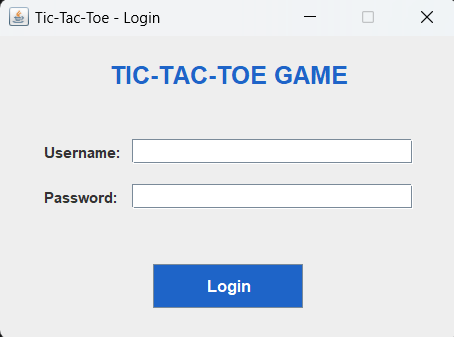
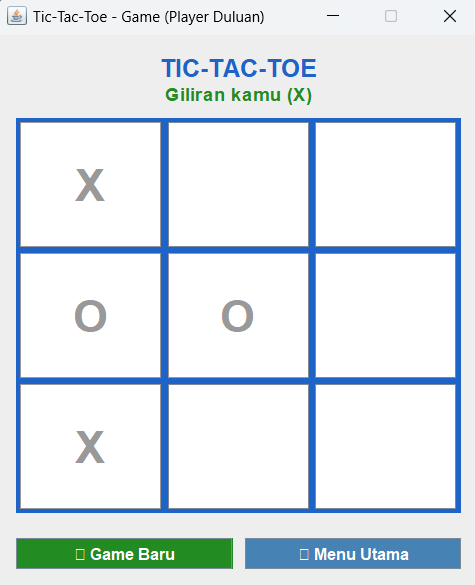
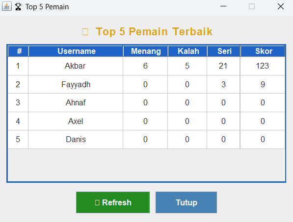

# Simple Tic-Tac-Toe Game with Java Swing, Login, and Statistics
## Student Information
Name:
Student ID:
Class:
## Project Description
This project is a simple Tic-Tac-Toe game built using Java Swing.
The application includes login, game statistics, and Top 5 scorer
feature.
## Features
- Login using database
- Play Tic-Tac-Toe using Swing GUI
- Record wins, losses, draws, and score
- Display personal statistics
- Display Top 5 scorers using JTable
## Database
Database used: PostgreSQL
## How to Run
1. Create the database.
2. Import schema.sql.
3. Open the Java project.
4. Add JDBC driver.
5. Configure DatabaseManager.java.
6. Run Main.java.
## Class Explanation

**Main:**
Entry point dari program. Saat dijalankan, class ini membuka LoginFrame
menggunakan SwingUtilities.invokeLater untuk memastikan GUI berjalan
di thread yang benar.

**DatabaseManager:**
Mengelola koneksi JDBC ke database PostgreSQL. Menyimpan URL, username,
dan password koneksi. Setiap class yang membutuhkan koneksi database
cukup memanggil method getConnection() dari class ini.

**Player:**
Class model yang menyimpan data pemain sesuai kolom tabel players di
database, yaitu id, username, wins, losses, draws, dan score. Objek
Player dibuat saat login berhasil dan dibawa ke semua jendela aplikasi.

**PlayerService:**
Menangani semua operasi database yang berkaitan dengan pemain. Terdiri
dari tiga method utama: login() untuk memverifikasi username dan password,
updateStatistics() untuk mengupdate wins/losses/draws/score setelah game
selesai, dan getTopFiveScorers() untuk mengambil 5 pemain dengan skor
tertinggi dari database.

**GameLogic:**
Menangani semua logika permainan Tic-Tac-Toe. Method makeMove() memvalidasi
apakah sel yang dipilih masih kosong. Method checkWinner() mengecek 8 pola
kemenangan (3 baris, 3 kolom, 2 diagonal). Method isDraw() mengecek apakah
semua sel terisi tanpa pemenang. Method computerMove() menentukan gerakan
komputer dengan strategi: menang jika bisa, blok player, ambil tengah,
ambil sudut, atau ambil sel kosong acak.

**LoginFrame:**
Jendela Swing pertama yang muncul saat aplikasi dijalankan. Pengguna
memasukkan username dan password, lalu program memanggil
PlayerService.login(). Jika berhasil, MainMenuFrame dibuka. Jika gagal,
ditampilkan pesan error menggunakan JOptionPane.

**MainMenuFrame:**
Jendela menu utama yang muncul setelah login berhasil. Menyediakan 4
tombol navigasi: Mulai Game (membuka GameFrame), Statistik Saya (membuka
StatisticsFrame), Top 5 Pemain (membuka TopScorersFrame), dan Keluar
(menutup aplikasi).

**GameFrame:**
Jendela permainan Tic-Tac-Toe dengan papan 3x3 berupa 9 JButton. Pemain
menggunakan simbol X dan komputer menggunakan simbol O. Setiap klik tombol
memanggil GameLogic untuk validasi gerakan, pengecekan menang atau seri,
dan gerakan komputer. Setelah game selesai, statistik diupdate ke database
melalui PlayerService.

**StatisticsFrame:**
Jendela yang menampilkan statistik pribadi pemain yang sedang login.
Data selalu diambil langsung dari database menggunakan getPlayerById()
agar menampilkan data terbaru, lalu ditampilkan dalam bentuk label
untuk wins, losses, draws, dan score.

**TopScorersFrame:**
Jendela yang menampilkan 5 pemain dengan skor tertinggi menggunakan
komponen JTable. Data diambil dari database melalui getTopFiveScorers()
dan dimasukkan baris per baris ke DefaultTableModel. Tabel menampilkan
kolom ranking, username, menang, kalah, seri, dan skor.
## Screenshots

## Video Link
YouTube: https://youtu.be/HHm7LpON0y0
